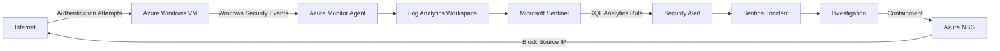

# Microsoft Sentinel RDP Brute-Force Detection & Incident Response Lab

## Project Overview

This project demonstrates an end-to-end Security Operations Center (SOC)
workflow using Microsoft Azure and Microsoft Sentinel.

I configured a Windows virtual machine to send security telemetry to Microsoft Sentinel, developed a custom KQL analytics rule to detect repeated 
failed authentication attempts, investigated a generated security incident, 
and contained the threat using an Azure Network Security Group (NSG).

The project demonstrates the workflow:

Detection → Alert → Incident → Investigation → Containment → Verification

## Technologies Used

- Microsoft Azure
- Microsoft Sentinel
- Microsoft Defender
- Azure Log Analytics
- Kusto Query Language (KQL)
- Windows Security Events
- Azure Network Security Groups (NSG)

## Skills Demonstrated

- SIEM monitoring
- Security log analysis
- KQL querying
- Detection engineering
- Brute-force detection
- Incident triage
- Incident investigation
- Windows authentication analysis
- Network-level containment

## Lab Architecture

## Detection & Response Workflow

1. Windows authentication events were collected from the Azure VM.
2. Microsoft Sentinel monitored Event ID 4625 for failed authentication attempts.
3. A custom KQL analytics rule identified repeated failures from the same source IP.
4. Sentinel generated an alert and created an incident.
5. The incident was triaged and investigated using KQL.
6. Event ID 4624 was reviewed to check for successful authentication.
7. Targeted accounts, attack duration, and Windows failure codes were analyzed.
8. The malicious source was contained using an Azure NSG deny rule.
9. Post-containment telemetry was reviewed to verify the response.
